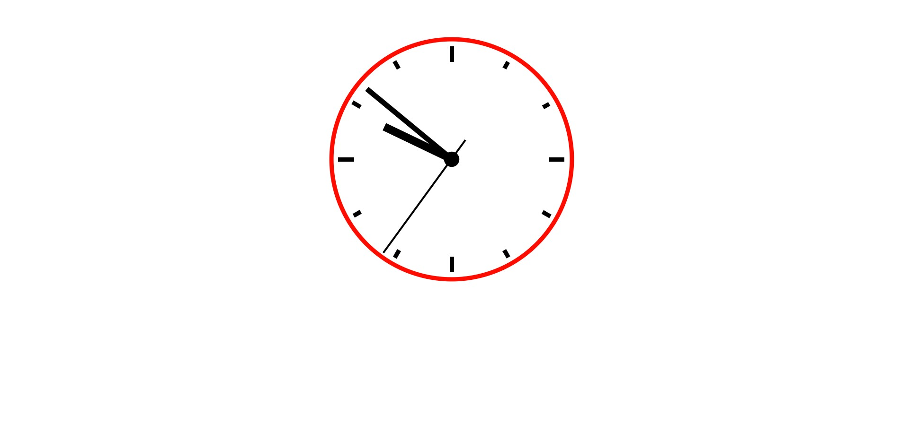

um pequeno projeto de um relógio analógico usando HTML, CSS e JavaScript.
feito através do Linkedin Learning.
<h1 align="center"> Relógio Analógico </h1>

Pequeno projeto desenvolvido no Linkedin Learning  

  

## 🚀 Tecnologias

Esse projeto foi desenvolvido com as seguintes tecnologias:

- HTML e CSS
- JavaScript
- Git e Github

## 💻 Projeto

um pequeno projeto de um relógio analógico do Linkedin Learning.

- [visite o projeto online] (https://gsilvaol.github.io/nlw-setup/)
